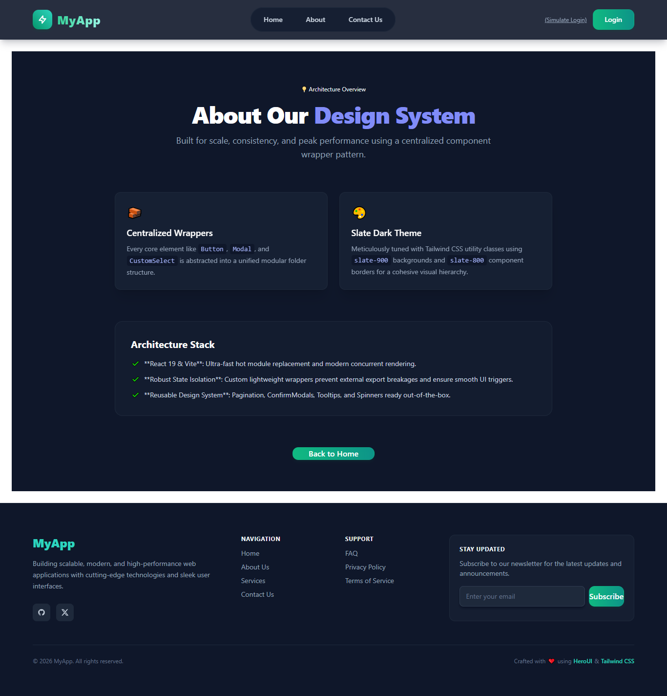
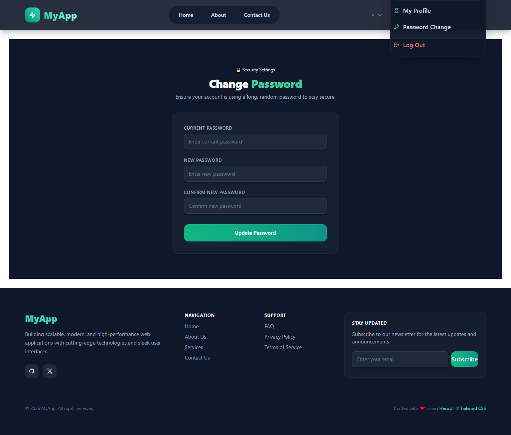
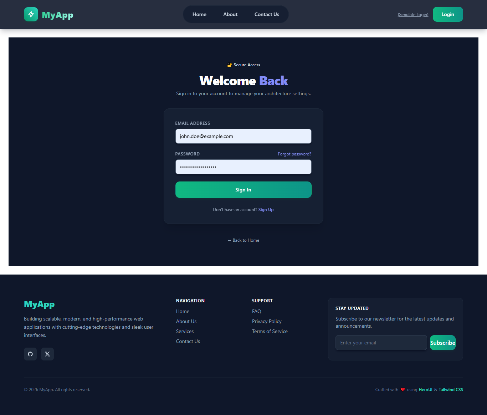
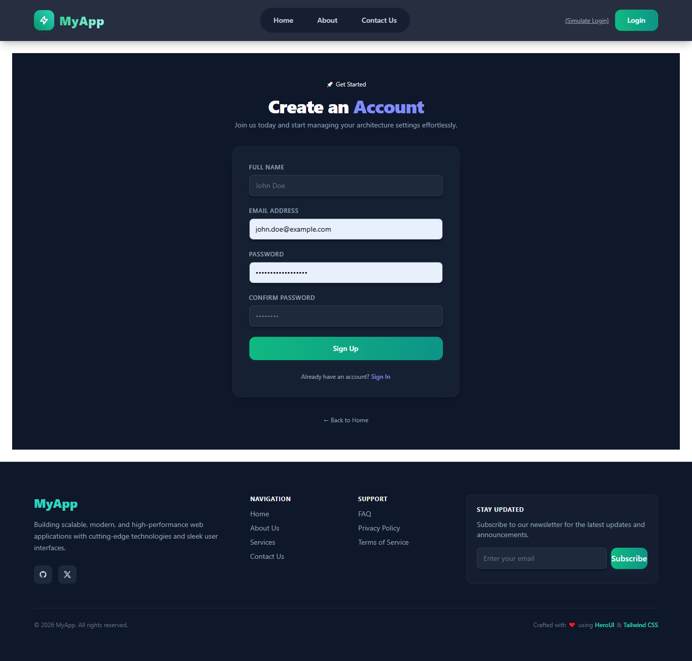

# NavFooterAuth

A high-performance, scalable, and modern web application built with **React**, **HeroUI**, and **Tailwind CSS**. It features a sleek dark-themed UI, dynamic custom reusable components, and secure authentication flows.

---

## ✨ Features

- **Modern Tech Stack:** Built with React, Tailwind CSS, and HeroUI for fluid styling and high accessibility.
- **Custom Reusable Component Library:** Clean modular components including Buttons, Inputs, Modals, Badges, Tooltips, Cards, Pagination, and custom Select inputs.
- **Responsive Navigation & Footer:** Optimized layouts for mobile, tablet, and desktop views.
- **Security & User Settings:** Dedicated **Change Password** flow with robust validation and interactive states.
- **Dark Theme First:** Tailored sleek dark aesthetics (`bg-slate-900`) accented with gorgeous emerald-to-teal gradients.

---

Installation
Clone the repository:

Bash
git clone (https://github.com/CheSubhro/NavFooter-Auth.git)
Navigate into the project directory:

Bash
cd NavFooter-Auth
Install dependencies:

Bash
npm install
Run the development server:

Bash
npm run dev

👨‍💻 Developed by CheSubhro Built with 💜 for a seamless experience.
